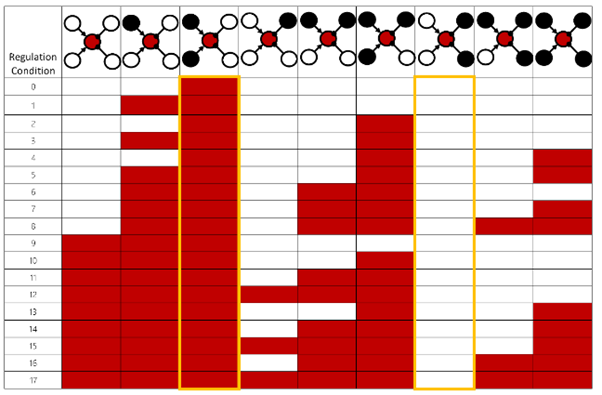
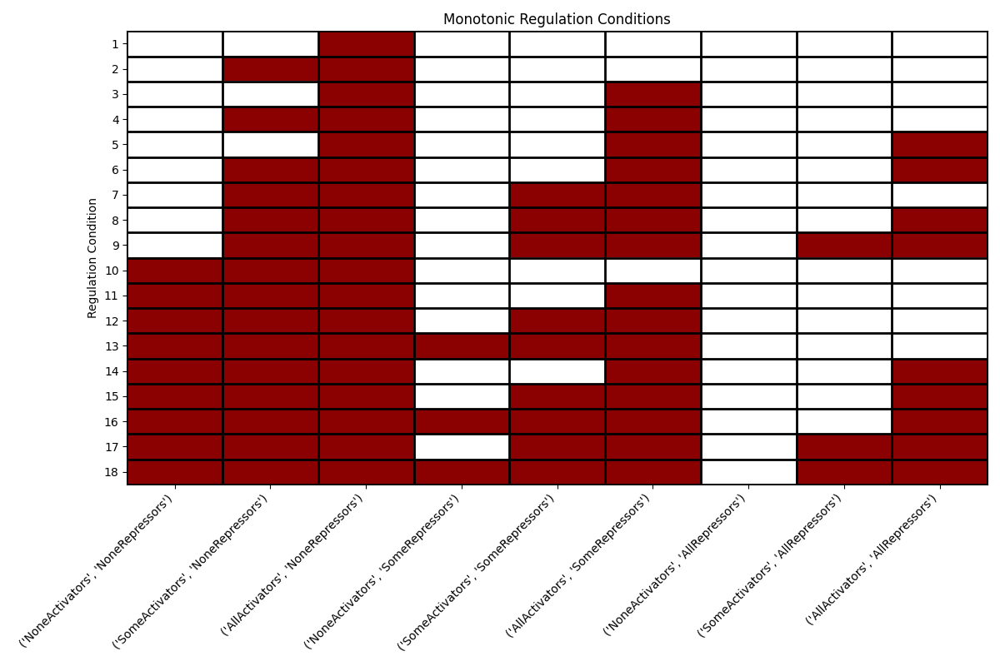

# Monotonic Regulation Conditions of the Reasoning Engine

In this program we find all the monotonic regulation conditions of the reasoning engine as studied in Biological Computation class and presented in the following table:



The program will show that the 18 rows in the  table correspond to the only regulation conditions that satisfy monotonic requirement and will consider whether none, some or all of the activators/repressors are present.

The results can be seen below:



## Usage
### Prerequisites
- Python 3.6 or higher installed on your machine.
### Installation

- Clone the repository:
```
git clone https://github.com/daniel1407y/BiologicalComputation.git
```
- Run`project.py`.

The output is presented in the table opened at the end of the running code, and in `monotonic_regulation_conditions.csv`as well.
